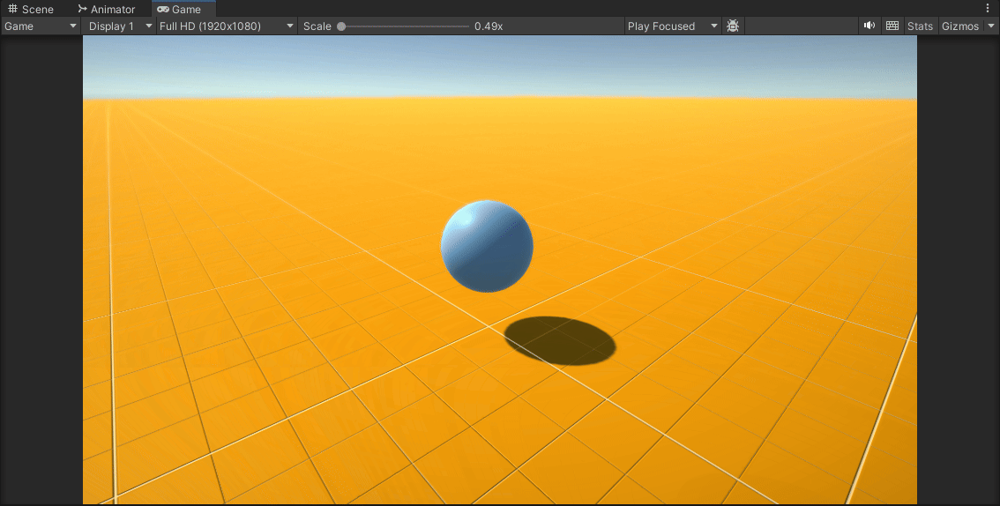
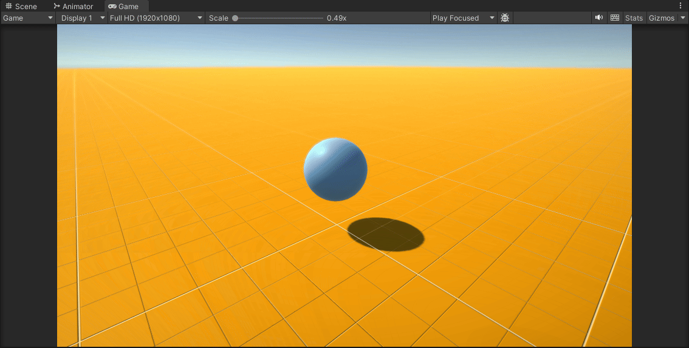

# Scripts - Movimiento rectilíneo 1

1. Crear un script que mueva el objeto hacia un punto fijo que se marque como objetivo utilizando el método Translate de la clase Transform. El objetivo debe ser una variable pública, de esta forma conseguimos manipularla en el inspector y ver el efecto de distintos valores en las coordenadas. Utilizar `this.transform.Translate(goal)` en el start, solo se mueve una vez 

Script: [Ejercicio1.cs](scripts/Ejercicio1.cs)

Experimentar las siguientes opciones:

a. Añadir this.transform.Translate(goal); al Update e ir multiplicando goal = goal * 0.5f; en el start para dar saltos más pequeños cada vez.

Script: [Ejercicio1A.cs](scripts/Ejercicio1A.cs)

b. Configurar la coordenada Y del Objetivo en 0.

c. Poner al Objetivo una coordenada Y distinta de cero.

d. Modificar el script para que el objeto despegue del suelo y vuele como un avión.

Script: [Ejercicio1D.cs](scripts/Ejercicio1D.cs)

e. Duplicar los valores de X, Y, Z del Objetivo. ¿Es consistente el movimiento? 
El movimiento no es consistente con anteriores ejercicios, puesto que importan tanto la dirección como la magnitud del vector y por lo tanto la cantidad de movimiento aplicada es mayor.

2. El Objetivo no es un objetivo propiamente dicho, sino una dirección en la que queremos movernos. La información relevante de un vector es la dirección. Los vectores normalizados, conservan la misma dirección pero su escala no afecta al movimiento. Se debe conseguir un movimiento consistente de forma que la escala no afecte a la traslación. Del mismo modo, se debe conseguir que el recorrido realizado por el personaje entre un frame y otro no tenga aberraciones espacio-temporales. Para ello se debe considerar la relación entre la velocidad, el espacio y el tiempo. Por otra parte, el tiempo que transcurre entre un frame y otro se obtiene con: `Time.deltaTime`

Script: [Ejercicio2.cs](scripts/Ejercicio2.cs)

3.  En lugar de seguir usando una dirección como objetivo, vamos a movernos ahora hacia una verdadera posición objetivo. Lo agregarermos como un campo público en la clase para poder configurarlo desde le Inspector. También agregaremos un campo para configurar la velocidad del personaje desde el propio Inspector. Aunque queramos desplazarnos hacia un punto en el espacio, el método Translate debe recibir la dirección del movimiento. La dirección que une dos puntos se obtiene restando el más lejano al más cercano. Por último, si el personaje no está encarando el objetivo (podría incluso estar de espaldas a él), el desplazamiento será suave pero la orientación de su malla no será consistente. Por esta razón será necesario rotarlo de forma que su eje z local (forward) apunte hacia el objetivo. La funciónLookAt del Transform nos ayudará con esto. En este caso, por tanto, para movernos hacia un punto en el espacio que configuramos a una velocidad dada:

4. Añadir Debug.DrawRay(this.transform.position,direction,Color.red) para depuración para comprobar que la dirección está correctamente calculada.

Script: [Ejercicio4.cs](scripts/Ejercicio4.cs)

5. Agregar un cubo en la escena que hará de objetivo, que debe ser movido usando el controlador de los Starter Assets. Sobre la escena que has trabajado ubica un personaje que va a seguir al cubo.

Script: [Ejercicio5.cs](scripts/Ejercicio5.cs)

6. En esta sesión se trabaja el Movimiento rectilíneo hacia el objeti haciendo avanzar al personaje siempre en línea recta hacia adelante.  Para ello, el personaje debe rotar hacia el objetivo y luego avanzar en la dirección foward. En este caso hay  que destacar que el método Translate de la clase Transform tiene dos formas de realizar la traslación. Esto lo podemos resolver rotando al personaje hacia su objetivo (LookAt) y trasladándolo en el eje forward, respecto al sistema de referencia local, lo que corresponde al valor por defecto del parámetro de Translate: relativeTo. Sin embargo, imagina que el personaje está dentro de un vehículo que también se está moviendo. Si solo avanzamos en el eje Z local, el personaje se moverá hacia adelante en relación al vehículo, pero no necesariamente hacia el objetivo en el mundo. Para resolver esto lo que debemos hacer es movernos en la dirección correcta con respecto a sistema de referencia mundial, que corresponde al valor Space.World del parámetro relativeTo de la clase Transform. En este ejercicio experimentamos con estas cuestiones:

a. Realizar un script que gire al personaje hacia su objetivo para llegar hasta él desplazándose sobre su vector forward local.

Script: [Ejercicio6A.cs](scripts/Ejercicio6A.cs)

b. Realizar un script que gire al personaje y lo desplace hacia su objetivo sobre la dirección que lo une con su objetivo. Normarlizar la dirección para evitar la influencia de la magnitud del vector

Script: [Ejercicio6B.cs](scripts/Ejercicio6B.cs)

c. Realizar un script que gire al personaje y lo desplace hacia su objetivo en la dirección que lo une con él, respecto al sistema de referencia mundial.
Normarlizar la dirección para evitar la influencia de la magnitud del vector.

Script: [Ejercicio6C.cs](scripts/Ejercicio6C.cs)

7. Cuando ejecutamos el script, el personaje calcula la dirección hacia el objetivo y se mueve hacia él, pero no puede dejar de moverse y se produce jittering. La razón es que todavía estamos dentro del bucle, calculando la dirección y moviéndonos hacia él. En la mayoría de los casos no vamos a conseguir que nuestro personaje se mueva a la posición exacta del objetivo, con lo que continuamente oscila en torno a esa posición. Por eso, debemos tener algún cálculo del tipo de rango de tolerancia. Incluimos una variable global pública, public float accuracy = 0.01f; y una condición if(direction.magnitude > accuracy). Aún con el accuracy, el personaje puede hacer jitter si la velocidad es muy alta.

Script: [Ejercicio7.cs](scripts/Ejercicio7.cs)

8. En esta sesión se trabaja el Movimiento rectilíneo haciendo avanzar al personaje siempre en línea recta hacia adelante introduciendo una mejora. El uso de la función LookAt hace que el personaje gire instantáneamente hacia el objetivo, provocando cambios bruscos. Se aconseja realizar una transición suave a lo largo de diferentes frames. Para ello, en lugar de computar una rotación del ángulo necesario, se realizan sucesivas rotaciones donde el ángulo en cada frame viene dado por los valores intermedios al interpolar la dirección original y la final. Para esto utilizaremos la función Slerp de la clase Quaternion: Un quaternion es un instrumento matemático que facilita el cálculo de rotaciones evitando el Gimbal Lock.

Script: [Ejercicio8.cs](scripts/Ejercicio8.cs)

9. En esta sección se trabaja un sistema básico de Waypoints. Se debe crear un circuito en una escena con la colección de puntos que conforman el circuito. Cada punto del circuito será un objeto 3D al que se le asigne la etiqueta “waypoint”. También se agregará un objeto personaje que será el que recorra los objetivos. Este objeto debe implementar el script con la mecánica de recorrido del circuito. Para ello, debe recuperar la referencia a cada uno de los objetivo y realizar los desplazamientos de un objetivo a otro aplicando el trabajo anterior. En la lógica se debe incluir la gestión de obtener quién es el siguiente objetivo.

Script: [Ejercicio9.cs](scripts/Ejercicio9.cs)

10. En esta sección se trabaja con el sistema de Waypoints de Unity. Para ello debes importar como asset en el proyecto la carpeta Utility. Configura el circuito, agrega el objetivo que debe perseguir el personaje y añade al personaje que recorrerá el circuito el script WaypointProgressTracker. Finalmente agrega un script al personaje que lo haga perseguir al objetivo. El sistema moverá el objetivo alejándolo del personaje moviéndose de un punto a otro del circuito. El personaje intenta perseguir al objetivo con nuestro script, por tanto, está “obligando” al objetivo a ir de un punto a otro a la par que lo persigue.

